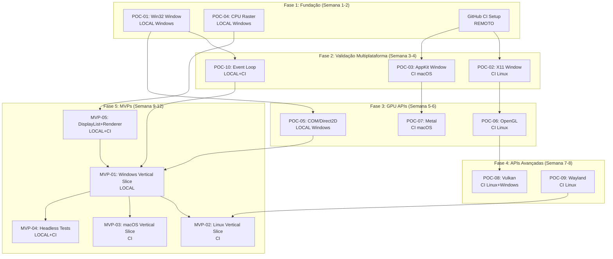

# Plano POC/MVP — Implementação Inicial do Framework Multiplataforma 100% Puro Dart

> **Documento complementar ao:** `ROTEIRO_FRAMEWORK_MULTIPLATAFORMA_100_PURO_DART.md`
> **Projeto:** `C:\MyDartProjects\dart_ui`
> **Objetivo:** Validar viabilidade técnica e superar desafios iniciais antes da implementação completa
> **Ambiente de desenvolvimento local:** Windows 10/11 x64
> **Ambientes de teste remoto:** Linux (Ubuntu) e macOS via GitHub Actions CI
> **Data de criação:** 2026-08-04

---

# Sumário

- [1. Objetivo do POC/MVP](#1-objetivo-do-pocmvp)
- [2. Diferença entre POC e MVP](#2-diferença-entre-poc-e-mvp)
- [3. Inventário de código reutilizável dos projetos existentes](#3-inventário-de-código-reutilizável-dos-projetos-existentes)
- [4. Desafios técnicos críticos e spikes obrigatórios](#4-desafios-técnicos-críticos-e-spikes-obrigatórios)
- [5. POC-01: WndProc Callback em Puro Dart (Windows)](#5-poc-01-wndproc-callback-em-puro-dart-windows)
- [6. POC-02: X11/XCB Window via FFI (Linux — GitHub CI)](#6-poc-02-x11xcb-window-via-ffi-linux--github-ci)
- [7. POC-03: AppKit Window via Objective-C Runtime FFI (macOS — GitHub CI)](#7-poc-03-appkit-window-via-objective-c-runtime-ffi-macos--github-ci)
- [8. POC-04: Rasterização CPU em Pixel Buffer sem GPU](#8-poc-04-rasterização-cpu-em-pixel-buffer-sem-gpu)
- [9. POC-05: COM/vtable em Puro Dart para Direct2D](#9-poc-05-comvtable-em-puro-dart-para-direct2d)
- [10. POC-06: OpenGL Context via FFI (Linux)](#10-poc-06-opengl-context-via-ffi-linux)
- [11. POC-07: Metal via Objective-C Runtime FFI (macOS)](#11-poc-07-metal-via-objective-c-runtime-ffi-macos)
- [12. POC-08: Vulkan Loader via FFI](#12-poc-08-vulkan-loader-via-ffi)
- [13. POC-09: Wayland Client via FFI (Linux)](#13-poc-09-wayland-client-via-ffi-linux)
- [14. POC-10: Event Loop unificado Dart + Plataforma](#14-poc-10-event-loop-unificado-dart--plataforma)
- [15. MVP-01: Vertical Slice Windows — Janela + CPU Render + Button](#15-mvp-01-vertical-slice-windows--janela--cpu-render--button)
- [16. MVP-02: Vertical Slice Linux — X11 + CPU Render + Button (CI)](#16-mvp-02-vertical-slice-linux--x11--cpu-render--button-ci)
- [17. MVP-03: Vertical Slice macOS — AppKit + CPU Render + Button (CI)](#17-mvp-03-vertical-slice-macos--appkit--cpu-render--button-ci)
- [18. MVP-04: Backend Headless com Testes Multiplataforma](#18-mvp-04-backend-headless-com-testes-multiplataforma)
- [19. MVP-05: DisplayList + Renderer CPU via dart_graphics/marlin](#19-mvp-05-displaylist--renderer-cpu-via-dart_graphicsmarlin)
- [20. Estrutura de diretórios do POC/MVP](#20-estrutura-de-diretórios-do-pocmvp)
- [21. Ordem de execução dos POCs](#21-ordem-de-execução-dos-pocs)
- [22. Critérios de sucesso por POC/MVP](#22-critérios-de-sucesso-por-pocmvp)
- [23. Riscos específicos do POC e mitigações](#23-riscos-específicos-do-poc-e-mitigações)
- [24. Decisões técnicas que os POCs devem responder](#24-decisões-técnicas-que-os-pocs-devem-responder)
- [25. Estratégia de bootstrap do monorepo](#25-estratégia-de-bootstrap-do-monorepo)
- [26. GitHub CI Multiplataforma](#26-github-ci-multiplataforma)
- [27. Cronograma sugerido dos POCs](#27-cronograma-sugerido-dos-pocs)
- [28. Transição POC → MVP → Roteiro Principal](#28-transição-poc--mvp--roteiro-principal)
- [29. Checklist de prontidão para iniciar implementação completa](#29-checklist-de-prontidão-para-iniciar-implementação-completa)

---

# 1. Objetivo do POC/MVP

O objetivo é **validar as hipóteses técnicas mais arriscadas** antes de investir no framework completo:

1. **Dart `dart:ffi` pode controlar janelas nativas** sem wrapper C/C++ em todas as 3 plataformas
2. **Callbacks nativos** (WndProc, Objective-C delegates, X11 event dispatch) funcionam de forma estável via `NativeCallable`
3. **Rasterização CPU em puro Dart** (usando `dart_graphics`/`marlin`) é viável para apresentação em framebuffer nativo
4. **COM vtables** podem ser construídas e chamadas em puro Dart para Direct2D/D3D11
5. **Objective-C Runtime** pode ser usado via FFI para criar classes, delegates e controlar AppKit
6. **APIs gráficas aceleradas** (OpenGL, Metal, Vulkan, Direct2D) podem ser inicializadas e usadas via FFI puro
7. **Event loop da plataforma** pode coexistir com o event loop do Dart sem deadlock ou starvation
8. **Linux e macOS podem ser testados exclusivamente via GitHub CI** enquanto só temos Windows local

> **Regra fundamental:** Cada POC é descartável. O código serve para aprender, não para entregar. O MVP reutiliza apenas aprendizados validados.

---

# 2. Diferença entre POC e MVP

| Aspecto | POC (Proof of Concept) | MVP (Minimum Viable Product) |
|---|---|---|
| **Objetivo** | Provar que algo é possível | Entregar funcionalidade mínima utilizável |
| **Código** | Descartável, hacky, um arquivo | Estruturado, testável, reutilizável |
| **Testes** | Manual / smoke test | Automatizados, goldens, CI |
| **Arquitetura** | Nenhuma obrigatória | Segue contratos do roteiro principal |
| **Duração** | Horas a poucos dias | Semanas |
| **Resultado** | Resposta binária: funciona/não funciona | Aplicação executável com janela + widget |
| **Decisão** | Prosseguir/pivotar/abortar | Iniciar implementação completa |

---

# 3. Inventário de código reutilizável dos projetos existentes

## 3.1 De `marlin` (C:\MyDartProjects\marlin)

| Componente | Caminho | Uso no POC/MVP |
|---|---|---|
| Rasterizador Blend2D-like | `lib/src/blend2d/` | **Backend CPU canônico** — rasterização analítica cover/area, comp-ops, gradientes, patterns |
| Rasterizadores experimentais | `lib/src/rasterization_algorithms/` | Benchmarks comparativos, seleção de melhor algoritmo |
| PNG writer | `lib/src/png/` | Output de screenshots headless |
| OpenType parser | `lib/src/blend2d/text/` | Parser `cmap`, `glyf`, `loca`, `kern`, `name`, `OS/2` |
| Stroker | `lib/src/blend2d/geometry/bl_stroker.dart` | Strokes com todos caps/joins |
| Path | `lib/src/blend2d/geometry/bl_path.dart` | Path com quadTo/cubicTo/flatten |
| Pipeline comp-ops | `lib/src/blend2d/pipeline/` | 28+ compositing operations |
| Benchmarks | `benchmark/` | Harness de performance |

**Status:** Blend2D-like está funcional com raster analítico, gradientes, patterns, text shaping básico e ~10k poly/s.

## 3.2 De `dart_graphics` (C:\MyDartProjects\dart_graphics)

| Componente | Caminho | Uso no POC/MVP |
|---|---|---|
| Graphics2D API | `lib/src/dart_graphics/graphics2D.dart` | API de alto nível Canvas-like |
| AGG port | `lib/src/dart_graphics/` | Scanline rasterizer, outline renderer, cells AA |
| SVG parser | `lib/src/dart_graphics/svg/` | Parsing e renderização SVG |
| Tipografia | `lib/src/typography/` | OpenType typeface, glyph layout/plan |
| Command buffer | `lib/src/dart_graphics/recording/` | DrawCommand + CommandBuffer (record/playback) |
| Transform | `lib/src/dart_graphics/transform/` | Affine transforms |
| Color/Image | `lib/src/dart_graphics/primitives/`, `image/` | Cores, pixel formats, image buffers |
| Vertex sources | `lib/src/dart_graphics/vertex_source/` | Ellipse, arc, rounded rect, stroke |
| Spans | `lib/src/dart_graphics/spans/` | Gradients, patterns, image filters |
| Clipping | `lib/src/dart_graphics/clipper/` | Boolean ops para paths |
| Vector math | `lib/src/vector_math/` | Matrizes e vetores |

**Status:** API completa até Fase 7 (backend agnóstico), Fase 8 em progresso (otimização).

## 3.3 De referências Avalonia (C:\MyDartProjects\dart_ui\referencias\Avalonia)

| Conceito | Caminho de referência | Uso |
|---|---|---|
| Win32 backend | `src/Windows/Avalonia.Win32/` | Padrões de WndProc, DPI, input |
| X11 backend | `src/Avalonia.X11/` | Atoms, EWMH, input, clipboard |
| Wayland backend | `src/Avalonia.Wayland/` | xdg-shell, seat, shm |
| Compositor | `src/Avalonia.Base/Rendering/Composition/` | Damage tracking, visual tree |
| Headless | `src/Headless/` | Backend sem janela real |
| OpenGL | `src/Avalonia.OpenGL/` | Context creation, EGL |
| Vulkan | `src/Avalonia.Vulkan/` | Instance, device, swapchain |
| Metal | `src/Avalonia.Metal/` | CAMetalLayer, drawable |

**Regra:** Conceitos e arquitetura, nunca código copiado diretamente (licença MIT permite, mas queremos APIs próprias).

## 3.4 De referências JFX (C:\MyDartProjects\dart_ui\referencias\jfx)

| Conceito | Módulo | Uso |
|---|---|---|
| Glass (windowing) | `modules/javafx.graphics/.../glass/` | Padrões de abstração de janela |
| Prism (rendering) | `modules/javafx.graphics/.../prism/` | Pipeline gráfico |
| Quantum (scheduling) | `modules/javafx.graphics/.../quantum/` | Frame scheduling, pulse |

**Regra:** GPLv2 — usar apenas como referência de arquitetura, nunca portar código.

---

# 4. Desafios técnicos críticos e spikes obrigatórios

## 4.1 Matriz de desafios

| ID | Desafio | Risco | Plataforma | POC associado |
|---|---|---|---|---|
| D01 | WndProc callback via NativeCallable | CRÍTICO | Windows | POC-01 |
| D02 | Estabilidade do callback durante reentrância | ALTO | Windows | POC-01 |
| D03 | X11 event loop integrado com Dart | ALTO | Linux | POC-02 |
| D04 | objc_msgSend com variantes de retorno | CRÍTICO | macOS | POC-03 |
| D05 | Registro dinâmico de classes ObjC | CRÍTICO | macOS | POC-03 |
| D06 | NSTextInputClient via FFI | ALTO | macOS | POC-03 |
| D07 | Performance de rasterização CPU em Dart | MÉDIO | Todos | POC-04 |
| D08 | COM vtable call e QueryInterface | ALTO | Windows | POC-05 |
| D09 | Implementação de IUnknown em Dart | ALTO | Windows | POC-05 |
| D10 | Criação de swapchain D3D11/DXGI | ALTO | Windows | POC-05 |
| D11 | EGL/GLX context creation | MÉDIO | Linux | POC-06 |
| D12 | CAMetalLayer e drawable lifecycle | ALTO | macOS | POC-07 |
| D13 | Vulkan instance + device via loader | MÉDIO | Linux/Windows | POC-08 |
| D14 | Wayland marshal/unmarshal de protocolo | ALTO | Linux | POC-09 |
| D15 | Event loop unificado sem starvation | CRÍTICO | Todos | POC-10 |
| D16 | Dart GC vs. ponteiros nativos vivos | ALTO | Todos | Todos POCs |
| D17 | NativeCallable.isolateLocal lifetime | ALTO | Todos | POC-01,02,03 |
| D18 | Struct alignment cross-platform | MÉDIO | Todos | Todos POCs |
| D19 | wchar_t/UTF-16 no Windows vs UTF-8 Linux/macOS | MÉDIO | Todos | POC-01,02,03 |
| D20 | AOT compilation + FFI working correctly | ALTO | Todos | Todos POCs |

## 4.2 Desafios que podem ABORTAR o projeto

Estes são bloqueadores potenciais. Se qualquer um deles não puder ser resolvido, o projeto precisa de redesign fundamental:

1. **`NativeCallable.isolateLocal` não funciona para WndProc** — Se o Dart runtime não suportar callback síncrono na thread do isolate para `WndProc`, será necessário avaliar alternativas (timer polling, que degradaria a responsividade)
2. **`objc_msgSend` não pode ser chamado com variantes corretas** — Se retorno de structs ou `objc_msgSend_stret` não funcionar via FFI, AppKit fica bloqueado
3. **COM vtable callbacks impossíveis** — Se Dart não puder implementar `IUnknown::QueryInterface` via callback FFI, Direct2D e UI Automation ficam bloqueados
4. **Performance de rasterização CPU inaceitável** — Se mesmo cenas simples não atingirem 30 FPS em 1920x1080, o modo CPU será apenas fallback de emergência
5. **Event loop morto** — Se integrar o message loop Win32/XCB/CFRunLoop com o Dart event loop causar deadlock irrecuperável

---

# 5. POC-01: WndProc Callback em Puro Dart (Windows)

## 5.1 Objetivo

Provar que Dart pode:
- Carregar `user32.dll`, `kernel32.dll`, `gdi32.dll`
- Registrar uma classe de janela com `WNDCLASSEXW`
- Criar `NativeCallable.isolateLocal` para `WndProc`
- Criar janela com `CreateWindowExW`
- Executar message loop com `GetMessageW`/`DispatchMessageW`
- Receber e processar `WM_PAINT`, `WM_SIZE`, `WM_CLOSE`, `WM_DESTROY`
- Desenhar com `FillRect` ou `BitBlt` de um buffer
- Fechar sem crash, leak ou callback tardio

## 5.2 Código mínimo esperado

```
poc/
└── poc_01_win32_window/
    ├── pubspec.yaml
    ├── bin/
    │   └── main.dart
    └── lib/
        ├── win32_bindings.dart    # Structs, constantes, funções
        ├── win32_window.dart      # Criação e lifecycle de janela
        └── win32_message_loop.dart # Loop de mensagens
```

## 5.3 Bindings mínimos necessários

### kernel32.dll
- `GetModuleHandleW`
- `GetLastError`

### user32.dll
- `RegisterClassExW`
- `UnregisterClassW`
- `CreateWindowExW`
- `ShowWindow`
- `UpdateWindow`
- `DestroyWindow`
- `DefWindowProcW`
- `GetMessageW`
- `TranslateMessage`
- `DispatchMessageW`
- `PostQuitMessage`
- `BeginPaint`
- `EndPaint`
- `FillRect`
- `GetClientRect`
- `InvalidateRect`
- `SetWindowTextW`
- `GetDpiForWindow` (Win10 1607+)
- `SetProcessDpiAwarenessContext` (Win10 1703+)

### gdi32.dll
- `CreateSolidBrush`
- `DeleteObject`
- `CreateDIBSection`
- `BitBlt`
- `SelectObject`
- `CreateCompatibleDC`
- `DeleteDC`

### Structs
- `WNDCLASSEXW`
- `MSG`
- `PAINTSTRUCT`
- `RECT`
- `CREATESTRUCTW`
- `BITMAPINFOHEADER`
- `BITMAPINFO`

## 5.4 WndProc callback pattern

```dart
// Tipo nativo
typedef WndProcNative = IntPtr Function(IntPtr hwnd, Uint32 msg, IntPtr wParam, IntPtr lParam);
typedef WndProcDart = int Function(int hwnd, int msg, int wParam, int lParam);

// Implementação
int _wndProc(int hwnd, int msg, int wParam, int lParam) {
  try {
    switch (msg) {
      case WM_PAINT:
        _handlePaint(hwnd);
        return 0;
      case WM_SIZE:
        _handleResize(hwnd, lParam & 0xFFFF, (lParam >> 16) & 0xFFFF);
        return 0;
      case WM_CLOSE:
        DestroyWindow(hwnd);
        return 0;
      case WM_DESTROY:
        PostQuitMessage(0);
        return 0;
      default:
        return DefWindowProcW(hwnd, msg, wParam, lParam);
    }
  } catch (e, st) {
    // NUNCA deixar exception cruzar a fronteira FFI
    print('WndProc error: $e\n$st');
    return DefWindowProcW(hwnd, msg, wParam, lParam);
  }
}

// Registrar callback
late final NativeCallable<WndProcNative> _wndProcCallable;

void _initCallback() {
  _wndProcCallable = NativeCallable<WndProcNative>.isolateLocal(
    _wndProc,
    exceptionalReturn: 0,
  );
}
```

## 5.5 Testes de stress

1. Abrir/fechar 1000 janelas em sequência
2. Resize agressivo (arrastar canto rapidamente)
3. `PostMessage` de tarefas Dart durante o loop
4. Forçar GC durante processamento de mensagens
5. Callback com `hwnd` de janela já destruída
6. Múltiplas janelas simultâneas
7. Unicode no título (português, CJK, emoji)
8. DPI awareness verificado com `GetDpiForWindow`
9. AOT compilation e execução
10. Verificar idle CPU quando nenhum evento chega

## 5.6 Critério de sucesso

- [ ] Janela aparece com cor sólida
- [ ] Redimensiona sem crash
- [ ] Título Unicode correto
- [ ] Alt+F4 e botão X fecham corretamente
- [ ] Sem crash após 1000 ciclos de abrir/fechar
- [ ] Callback permanece válido durante todo o ciclo de vida
- [ ] `WM_NCDESTROY` é o último processamento
- [ ] AOT funciona
- [ ] CPU idle < 1% quando parado
- [ ] Sem warning no `dart analyze`

## 5.7 Se falhar

- Se `NativeCallable.isolateLocal` não funcionar para WndProc:
  - Testar `NativeCallable.listener` com `PostMessage` para sinalizar
  - Avaliar timer polling (degradação aceitável?)
  - Verificar se Dart SDK tem plano para resolver
  - Documentar limitação com issue + versão do SDK

---

# 6. POC-02: X11/XCB Window via FFI (Linux — GitHub CI)

## 6.1 Objetivo

Provar que Dart pode via FFI:
- Carregar `libxcb.so.1`
- Conectar ao X server
- Criar janela
- Mapear (mostrar)
- Receber eventos (expose, configure, key, button, motion)
- Desenhar com SHM ou PutImage
- Fechar corretamente

## 6.2 Ambiente de teste

Como não temos Linux local, **todo o teste acontece no GitHub CI**:
- Ubuntu com Xvfb (X virtual framebuffer)
- Sem GPU real
- Captura de screenshot via `xwd` ou PutImage + PNG export
- Testes automatizados que verificam:
  - Janela foi criada (connection OK, window ID válido)
  - Evento de expose recebido
  - Pixels foram escritos no buffer
  - Fechar não gera core dump

## 6.3 Código mínimo

```
poc/
└── poc_02_x11_window/
    ├── pubspec.yaml
    ├── bin/
    │   └── main.dart
    └── lib/
        ├── xcb_bindings.dart     # xcb_connect, xcb_create_window, etc.
        ├── xcb_window.dart       # Criação e lifecycle
        ├── xcb_event_loop.dart   # Poll de eventos
        └── xcb_surface.dart      # SHM ou PutImage
```

## 6.4 Funções XCB necessárias

- `xcb_connect`
- `xcb_connection_has_error`
- `xcb_get_setup`
- `xcb_setup_roots_iterator`
- `xcb_generate_id`
- `xcb_create_window`
- `xcb_map_window`
- `xcb_flush`
- `xcb_poll_for_event` / `xcb_wait_for_event`
- `xcb_intern_atom` / `xcb_intern_atom_reply`
- `xcb_change_property`
- `xcb_destroy_window`
- `xcb_disconnect`
- `xcb_put_image` (bootstrap sem SHM)
- Opcionais: `xcb_shm_*` para performance

## 6.5 Atoms essenciais

- `WM_PROTOCOLS`
- `WM_DELETE_WINDOW`
- `_NET_WM_NAME`
- `UTF8_STRING`

## 6.6 Critério de sucesso

- [ ] Conexão ao X server no CI (Xvfb) funciona
- [ ] Janela é criada e mapeada
- [ ] Evento `XCB_EXPOSE` é recebido
- [ ] Pixels são escritos via `xcb_put_image`
- [ ] `WM_DELETE_WINDOW` funciona (atom internado, property setada, evento capturado)
- [ ] Desconexão limpa
- [ ] AOT funciona no Linux
- [ ] CI passa sem falhas intermitentes

---

# 7. POC-03: AppKit Window via Objective-C Runtime FFI (macOS — GitHub CI)

## 7.1 Objetivo

Este é o POC **mais arriscado** porque requer:
- Chamar `objc_msgSend` e suas variantes (`_stret`, `_fpret`)
- Registrar classes Dart-backed no runtime ObjC
- Implementar delegates via callbacks FFI
- Criar `NSApplication`, `NSWindow`, `NSView`
- Controlar run loop

## 7.2 Funções do Objective-C Runtime necessárias

De `libobjc.dylib`:
- `objc_getClass`
- `objc_allocateClassPair`
- `objc_registerClassPair`
- `objc_msgSend` (e variantes)
- `sel_registerName`
- `class_addMethod`
- `class_addIvar`
- `object_setIvar` / `object_getIvar`
- `class_getInstanceVariable`
- `class_replaceMethod` (opcional)
- `objc_setAssociatedObject` / `objc_getAssociatedObject`

## 7.3 Pattern para chamar Objective-C

```dart
// Exemplo conceitual
final objcMsgSend = dylib.lookupFunction<
  Pointer Function(Pointer, Pointer),
  Pointer Function(Pointer, Pointer)
>('objc_msgSend');

final nsAppClass = objcGetClass('NSApplication'.toNativeUtf8());
final sharedAppSel = selRegisterName('sharedApplication'.toNativeUtf8());
final nsApp = objcMsgSend(nsAppClass, sharedAppSel);
```

## 7.4 Desafios específicos macOS

1. **Variantes de `objc_msgSend`:**
   - `objc_msgSend` — retorno inteiro/ponteiro
   - `objc_msgSend_stret` — retorno struct por valor (x86_64 only, arm64 usa registradores)
   - `objc_msgSend_fpret` — retorno float (x86_64 only)
   - Cada uma precisa de tipo FFI diferente

2. **Registro de classe ObjC com método Dart:**
   ```dart
   // Criar subclasse de NSObject
   final myDelegateClass = objcAllocateClassPair(nsObjectClass, 'DartAppDelegate', 0);
   
   // Adicionar método
   final callback = NativeCallable<...>.isolateLocal(myAppDidFinishLaunching);
   classAddMethod(myDelegateClass, sel, callback.nativeFunction, types);
   
   // Registrar
   objcRegisterClassPair(myDelegateClass);
   ```

3. **NSApplication lifecycle:**
   - `[NSApplication sharedApplication]`
   - `[NSApp setActivationPolicy: NSApplicationActivationPolicyRegular]`
   - `[NSApp setDelegate: myDelegate]`
   - `[NSApp run]` ← **Bloqueia!** Precisa integrar com Dart event loop

4. **NSView drawRect:**
   - Registrar subclasse de NSView
   - Adicionar método `drawRect:` com callback FFI
   - Receber `NSRect` como parâmetro
   - Desenhar via Core Graphics context

## 7.5 Ambiente de teste

- macOS runner no GitHub CI (arm64 ou x64)
- Sessão GUI necessária para NSApplication
- `defaults write` para configurar headless quando possível
- Screenshots via `screencapture` se sessão disponível
- Testes mínimos de lifecycle sem renderização visual

## 7.6 Critério de sucesso

- [ ] `objc_msgSend` funciona para chamadas básicas
- [ ] Classe ObjC registrada com método Dart
- [ ] `NSApplication` inicializa
- [ ] `NSWindow` é criada
- [ ] `NSView` com `drawRect:` callback funciona
- [ ] Delegate recebe `applicationDidFinishLaunching:`
- [ ] Fechar janela não causa crash
- [ ] AOT funciona no macOS
- [ ] Funciona em arm64 (Apple Silicon)
- [ ] Funciona em x64 (Intel) se CI disponível

## 7.7 Se falhar

- **`objc_msgSend` variantes incompatíveis:** Usar `dart:ffi` `@Native` annotation se disponível, ou criar lookup tables por assinatura
- **Registro de classe falha:** Verificar se `ffigen` com suporte ObjC pode gerar parte do boilerplate
- **Run loop deadlock:** Usar `NSTimer` para pump Dart tasks, ou `performSelector:onThread:` para integração

---

# 8. POC-04: Rasterização CPU em Pixel Buffer sem GPU

## 8.1 Objetivo

Provar que `dart_graphics`/`marlin` pode:
- Renderizar uma cena 2D em um `Uint8List` (BGRA premultiplicado)
- Performance ≥ 30 FPS em 800x600 para uma cena simples (fundo + 10 retângulos + texto)
- O buffer pode ser apresentado via GDI `BitBlt` (Windows), `xcb_put_image` (Linux) ou `CGBitmapContext` (macOS)

## 8.2 Integração com projetos existentes

### Opção A: Usar `marlin` Blend2D-like diretamente
```dart
import 'package:marlin/src/blend2d/blend2d.dart';

// Criar imagem/buffer
final image = BLImage(width, height);
final ctx = BLContext(image);

// Desenhar
ctx.setFillColor(0xFF3366CC);
ctx.fillRect(BLRect(10, 10, 200, 100));

// Obter pixels como Uint8List para apresentação nativa
final pixels = image.pixels; // BGRA premultiplicado
```

### Opção B: Usar `dart_graphics` Graphics2D
```dart
import 'package:dart_graphics/dart_graphics.dart';

final buffer = PixelBuffer(width, height); // BGRA
final g2d = Graphics2D(buffer);

g2d.fillColor = Color.fromARGB(0xFF, 0x33, 0x66, 0xCC);
g2d.fillRect(10, 10, 200, 100);

// Obter pixels
final pixels = buffer.data; // Uint8List
```

### Decisão para o POC
Usar **ambos** em benchmarks comparativos para decidir qual será o backend CPU canônico do framework.

## 8.3 Benchmark mínimo

```dart
void benchmarkCpuRender() {
  final width = 800;
  final height = 600;
  final iterations = 100;
  
  // Cena: fundo + 10 retângulos coloridos + 1 path curvo + texto "Hello"
  final stopwatch = Stopwatch()..start();
  
  for (var i = 0; i < iterations; i++) {
    renderScene(width, height);
  }
  
  stopwatch.stop();
  final msPerFrame = stopwatch.elapsedMilliseconds / iterations;
  final fps = 1000 / msPerFrame;
  
  print('$msPerFrame ms/frame ($fps FPS)');
  assert(fps >= 30, 'CPU render deve atingir 30 FPS em 800x600');
}
```

## 8.4 Formatos de pixel por plataforma

| Plataforma | Formato esperado | Stride | Nota |
|---|---|---|---|
| Windows GDI (DIBSection) | BGRA premultiplicado | 4 * width (alinhado 4 bytes) | Top-down DIB |
| X11 (PutImage/SHM) | BGRA (depth 32) ou BGR (depth 24) | Depende do visual | Verificar byte order |
| macOS (CGBitmapContext) | BGRA premultiplicado | 4 * width | `kCGBitmapByteOrder32Little | kCGImageAlphaPremultipliedFirst` |

## 8.5 Critério de sucesso

Implementado em `poc/poc_04_cpu_raster` com renderer puro Dart, sem dependência
de GPU ou bindings nativos. Validado localmente em Windows em 2026-08-04.

- [x] ≥ 30 FPS em 800x600 com cena de 10 retângulos + texto (888,2 FPS)
- [x] ≥ 60 FPS em 400x300 com cena simples (2619,3 FPS)
- [x] Buffer BGRA8888 premultiplicado, top-down e com `stride = 4 * width`
- [x] Dirty rect com clipping e atualização parcial do elemento móvel
- [x] Buffer reutilizado; o caminho de renderização usa coordenadas escalares
- [x] Alpha blending source-over correto para cores premultiplicadas

Execução:

```powershell
dart test poc/poc_04_cpu_raster
dart run poc/poc_04_cpu_raster/bin/main.dart
dart run poc/poc_04_cpu_raster/bin/main.dart --quick
```

---

# 9. POC-05: COM/vtable em Puro Dart para Direct2D

> Dependência aprovada: `package:win32`. O workspace usa `win32 ^5.8.0`
> enquanto o SDK local permanecer em Dart 3.6; a série 6.x exige Dart 3.10.

## 9.1 Objetivo

Provar que Dart pode:
- Construir vtables COM em memória
- Chamar métodos COM via ponteiros de função
- Implementar `IUnknown` (QueryInterface, AddRef, Release)
- Criar factory D2D1
- Criar device D3D11
- Criar render target
- Chamar `BeginDraw`/`EndDraw`

## 9.2 Pattern de COM vtable em Dart

```dart
// Definir layout do vtable
final class IUnknownVtbl extends Struct {
  external Pointer<NativeFunction<Int32 Function(Pointer, Pointer<GUID>, Pointer<Pointer>)>> QueryInterface;
  external Pointer<NativeFunction<Uint32 Function(Pointer)>> AddRef;
  external Pointer<NativeFunction<Uint32 Function(Pointer)>> Release;
}

// Wrapper seguro
class ComPtr<T extends Struct> {
  Pointer<Pointer<T>> _ppVtbl;
  int _refCount = 1;
  bool _disposed = false;
  
  int queryInterface(Pointer<GUID> riid, Pointer<Pointer<Void>> ppv) {
    assert(!_disposed);
    final vtbl = _ppVtbl.value.ref;
    return vtbl.QueryInterface.asFunction<int Function(Pointer, Pointer<GUID>, Pointer<Pointer<Void>>)>()(
      _ppVtbl.cast(), riid, ppv,
    );
  }
  
  void release() {
    if (!_disposed) {
      final vtbl = _ppVtbl.value.ref;
      vtbl.Release.asFunction<int Function(Pointer)>()(_ppVtbl.cast());
      _disposed = true;
    }
  }
}
```

## 9.3 Sequência de teste

1. `CoInitializeEx(COINIT_APARTMENTTHREADED)`
2. `D2D1CreateFactory` → `ID2D1Factory`
3. `D3D11CreateDevice` → `ID3D11Device` + `ID3D11DeviceContext`
4. `QueryInterface` para `IDXGIDevice`
5. `CreateDXGIFactory2` → `IDXGIFactory2`
6. `CreateSwapChainForHwnd` → `IDXGISwapChain1`
7. `GetBuffer` → `IDXGISurface`
8. `CreateDxgiSurfaceRenderTarget` → `ID2D1RenderTarget`
9. `BeginDraw` + `Clear` + `EndDraw`
10. `Present`
11. `Release` tudo na ordem correta

## 9.4 GUID handling

```dart
final class GUID extends Struct {
  @Uint32() external int data1;
  @Uint16() external int data2;
  @Uint16() external int data3;
  @Array(8) external Array<Uint8> data4;
}

GUID createGUID(int d1, int d2, int d3, List<int> d4) {
  final guid = calloc<GUID>();
  guid.ref.data1 = d1;
  guid.ref.data2 = d2;
  guid.ref.data3 = d3;
  for (var i = 0; i < 8; i++) {
    guid.ref.data4[i] = d4[i];
  }
  return guid.ref;
}
```

## 9.5 Critério de sucesso

Implementação inicial em `poc/poc_05_com_direct2d`, validada localmente em
Windows em 2026-08-04. O POC usa `CoInitializeEx`, `D2D1CreateFactory` e o
wrapper `IUnknown` do pacote para confirmar a convenção de ponteiros COM.

- [x] `IUnknown` wrappers funcionam (QI, AddRef, Release)
- [x] `D2D1CreateFactory` retorna factory válida
- [x] `D3D11CreateDevice` cria device (feature level 11.0 validado)
- [ ] Swapchain é criada para um HWND
- [ ] `BeginDraw`/`Clear`/`EndDraw`/`Present` funciona
- [ ] Sem COM leak (contagem de Release == AddRef)
- [x] HRESULT tratado corretamente (`FAILED`/`SUCCEEDED` testados)
- [x] `GUID` layout correto (16 bytes; serialização testada)

```powershell
dart run poc/poc_05_com_direct2d/bin/main.dart
```

---

# 10. POC-06: OpenGL Context via FFI (Linux)

## 10.1 Objetivo

Provar que Dart pode via FFI criar um contexto OpenGL em Linux:
- Via EGL (preferido — funciona com X11 e Wayland)
- Via GLX (alternativa X11-only)

## 10.2 Funções necessárias

### libEGL.so.1
- `eglGetDisplay`
- `eglInitialize`
- `eglChooseConfig`
- `eglCreateContext`
- `eglCreateWindowSurface`
- `eglMakeCurrent`
- `eglSwapBuffers`
- `eglDestroyContext`
- `eglDestroySurface`
- `eglTerminate`

### libGL.so.1 / libGLESv2.so.2
- `glViewport`
- `glClearColor`
- `glClear`
- `glGetString`

## 10.3 Ambiente CI

- Ubuntu com Mesa (software renderer)
- Xvfb + `LIBGL_ALWAYS_SOFTWARE=1`
- EGL com GBM backend para headless quando possível

## 10.4 Critério de sucesso

- [ ] EGL display obtido
- [ ] Config escolhida
- [ ] Context criado (OpenGL ES 3.0 ou OpenGL 3.3)
- [ ] Surface criada (para XCB window ou EGL pbuffer)
- [ ] `glClearColor` + `glClear` funciona
- [ ] `glGetString(GL_VERSION)` retorna versão válida
- [ ] SwapBuffers não crasha
- [ ] Cleanup correto (destroy na ordem inversa)

---

# 11. POC-07: Metal via Objective-C Runtime FFI (macOS)

## 11.1 Objetivo

Provar que Dart pode:
- Obter `MTLDevice` via `MTLCreateSystemDefaultDevice()`
- Criar `MTLCommandQueue`
- Criar `CAMetalLayer`
- Obter `nextDrawable`
- Criar command buffer, render encoder
- Clear screen
- Present

## 11.2 Funções necessárias

De `Metal.framework` e `QuartzCore.framework`:
- `MTLCreateSystemDefaultDevice` (C function, não ObjC)
- Via `objc_msgSend`:
  - `[device newCommandQueue]`
  - `[layer setDevice:]`
  - `[layer nextDrawable]`
  - `[queue commandBuffer]`
  - `[commandBuffer renderCommandEncoderWithDescriptor:]`
  - `[encoder endEncoding]`
  - `[commandBuffer presentDrawable:]`
  - `[commandBuffer commit]`

## 11.3 Critério de sucesso

- [ ] `MTLDevice` obtido
- [ ] `CAMetalLayer` criada e configurada
- [ ] Clear render com cor sólida
- [ ] Present sem crash
- [ ] Resource cleanup correto
- [ ] Funciona em arm64 (Apple Silicon)

---

# 12. POC-08: Vulkan Loader via FFI

## 12.1 Objetivo

Provar que Dart pode:
- Carregar `libvulkan.so.1` (Linux) ou `vulkan-1.dll` (Windows)
- Obter `vkGetInstanceProcAddr`
- Criar `VkInstance`
- Enumerar physical devices
- Criar logical device
- (Opcional) Criar surface e swapchain

## 12.2 Structs críticas

- `VkApplicationInfo`
- `VkInstanceCreateInfo`
- `VkPhysicalDeviceProperties`

Todas requerem alignment correto e `sType` configurado.

## 12.3 Critério de sucesso

- [ ] Loader carregado
- [ ] `vkCreateInstance` retorna `VK_SUCCESS`
- [ ] `vkEnumeratePhysicalDevices` lista ≥ 1 device
- [ ] `VkPhysicalDeviceProperties` lido corretamente
- [ ] `vkDestroyInstance` não crasha
- [ ] Funciona no CI Linux com Mesa/lavapipe

---

# 13. POC-09: Wayland Client via FFI (Linux)

## 13.1 Objetivo

Provar que Dart pode:
- Carregar `libwayland-client.so.0`
- Conectar ao compositor
- Obter `wl_registry`
- Bind de `wl_compositor`, `wl_shm`, `xdg_wm_base`
- Criar `wl_surface` e `xdg_surface`
- Alocar `wl_shm_pool` e buffer
- Desenhar pixels e apresentar

## 13.2 Desafio especial: listeners/callbacks

Wayland usa um padrão de `listener` struct com ponteiros de função. Em C:

```c
struct wl_registry_listener {
    void (*global)(void *data, struct wl_registry *, uint32_t name, const char *interface, uint32_t version);
    void (*global_remove)(void *data, struct wl_registry *, uint32_t name);
};
wl_registry_add_listener(registry, &listener, data);
```

Em Dart, cada callback precisa de um `NativeCallable`:

```dart
final globalCallback = NativeCallable<...>.isolateLocal(_onGlobal);
final globalRemoveCallback = NativeCallable<...>.isolateLocal(_onGlobalRemove);

// Criar struct listener em memória
final listener = calloc<WlRegistryListener>();
listener.ref.global = globalCallback.nativeFunction;
listener.ref.global_remove = globalRemoveCallback.nativeFunction;
```

## 13.3 Ambiente CI

- Ubuntu com Weston (headless mode) ou `wl_display_create` + compositor mínimo
- Alternativamente: mocks de socket para testar marshal/unmarshal

## 13.4 Critério de sucesso

- [ ] Conexão ao compositor Wayland funciona
- [ ] Registry listeners recebem globals
- [ ] `wl_compositor` e `wl_shm` bindados
- [ ] Surface criada
- [ ] Buffer SHM alocado e preenchido com pixels
- [ ] `wl_surface_commit` funciona
- [ ] Fechar sem crash
- [ ] Listeners são cleaned up corretamente

---

# 14. POC-10: Event Loop unificado Dart + Plataforma

## 14.1 Objetivo

Provar que o event loop nativo de cada plataforma pode coexistir com o event loop do Dart (Zone, Futures, Streams, timers):

### Windows
- `MsgWaitForMultipleObjectsEx` com evento de wakeup
- Dart tasks executadas entre mensagens Win32
- `PostMessageW(WM_APP)` para acordar o loop

### Linux (X11)
- `poll()`/`epoll` no FD da conexão XCB + eventfd de wakeup
- Dart tasks executadas quando não há eventos XCB
- Timer integration via `timerfd` ou deadline em `poll`

### Linux (Wayland)
- `wl_display_get_fd()` + poll
- `wl_display_dispatch_pending()` entre Dart tasks
- Flush controlado

### macOS
- `CFRunLoopSourceRef` customizado no `CFRunLoop`
- Ou `NSTimer` periódico para pump Dart tasks
- Ou `performSelector:onThread:withObject:waitUntilDone:`

## 14.2 Pattern geral

```dart
abstract class PlatformEventLoop {
  /// Inicializar recursos nativos do loop
  void initialize();
  
  /// Executar uma iteração: processar eventos nativos + Dart tasks
  void pumpEvents(Duration timeout);
  
  /// Acordar o loop de outra thread/contexto
  void wake();
  
  /// Registrar callback para frame
  void scheduleFrame(void Function(Duration timestamp) callback);
  
  /// Registrar timer
  TimerHandle scheduleTimer(Duration delay, void Function() callback);
  
  /// Destruir
  void dispose();
}
```

## 14.3 Teste de starvation

```dart
// Cenário 1: Input pesado não bloqueia Dart
for (var i = 0; i < 10000; i++) {
  sendSyntheticMouseMove(i, i);
}
// Timer Dart de 100ms deve disparar no tempo

// Cenário 2: Dart computation não bloqueia input
Future.delayed(Duration.zero, () {
  expensiveComputation(); // 50ms
});
// Input deve ser processado durante gaps
```

## 14.4 Critério de sucesso

- [ ] Dart `Future.delayed` funciona dentro do loop nativo
- [ ] `Timer.periodic` dispara no timing correto
- [ ] Input nativo não é atrasado por Dart tasks
- [ ] Loop idle consome < 1% CPU
- [ ] Wake funciona de qualquer contexto
- [ ] Sem deadlock em nenhum cenário testado

---

# 15. MVP-01: Vertical Slice Windows — Janela + CPU Render + Button

## 15.1 Objetivo

A primeira aplicação interativa real:
- Janela Win32 com DPI awareness
- Renderização CPU via `dart_graphics`/`marlin` em DIBSection
- Um botão desenhado em puro Dart
- Mouse hover/pressed/click
- Teclado: Tab para focar, Enter/Space para ativar
- Texto atualizado via estado
- Dirty rect (repintar apenas o necessário)

## 15.2 Demonstração obrigatória

```
┌──────────────────────────────────┐
│  DartUI MVP — Counter            │
├──────────────────────────────────┤
│                                  │
│       Contagem: 42               │
│                                  │
│       ┌─────────────────┐        │
│       │   Incrementar   │        │
│       └─────────────────┘        │
│                                  │
└──────────────────────────────────┘
```

Interações:
- Hover: botão muda de cor
- Press: botão aparece pressionado
- Click: contagem incrementa
- Tab: foco visual no botão
- Enter/Space: ativa o botão
- Resize: layout se adapta
- DPI change: tudo re-escala

## 15.3 Arquitetura mínima

```
dart_ui/
├── packages/
│   ├── dart_ui_foundation/     # Tipos, geometry, colors
│   ├── dart_ui_platform/       # Interfaces de plataforma
│   ├── dart_ui_graphics_api/   # DisplayList, Paint, Path
│   ├── dart_ui_renderer_cpu/   # Backend CPU via dart_graphics
│   ├── dart_ui_backend_win32/  # Backend Win32
│   └── dart_ui_headless/       # Backend sem janela
└── examples/
    └── counter/                # Exemplo mínimo
```

## 15.4 Critério de sucesso

- [ ] Janela aparece com conteúdo renderizado por Dart
- [ ] Botão tem estados visuais (normal, hover, pressed, focused)
- [ ] Click funciona
- [ ] Teclado funciona
- [ ] Texto atualiza
- [ ] Dirty rect funciona
- [ ] Resize funciona
- [ ] DPI funciona
- [ ] Fecha sem leak
- [ ] AOT funciona
- [ ] Mesmo código de widget funciona no headless

---

# 16. MVP-02: Vertical Slice Linux — X11 + CPU Render + Button (CI)

## 16.1 Objetivo

Reutilizar o mesmo código de widget do MVP-01 com backend X11/XCB.

## 16.2 Diferenças

- XCB bindings no lugar de Win32
- `xcb_put_image` ou SHM no lugar de `BitBlt`
- `xkbcommon` para teclado
- Xvfb no CI

## 16.3 Critério de sucesso

- [ ] Mesma aplicação Counter roda sem alteração no código do widget
- [ ] CI verifica via screenshot/golden

---

# 17. MVP-03: Vertical Slice macOS — AppKit + CPU Render + Button (CI)

## 17.1 Objetivo

Reutilizar o mesmo código de widget do MVP-01 com backend AppKit.

## 17.2 Diferenças

- Objective-C Runtime bindings
- Core Graphics para apresentar buffer
- Run loop integration
- Retina DPI

## 17.3 Critério de sucesso

- [ ] Mesma aplicação Counter roda
- [ ] CI em macOS runner verifica

---

# 18. MVP-04: Backend Headless com Testes Multiplataforma

## 18.1 Objetivo

Backend que não precisa de sistema de janelas real:
- Virtual window com tamanho configurável
- Virtual input (mouse, keyboard)
- Framebuffer CPU
- Screenshot → PNG
- Golden comparison
- Roda em qualquer plataforma, inclusive CI sem display

## 18.2 API mínima

```dart
final headless = HeadlessBackend();
await headless.initialize(HeadlessConfig(
  windowSize: Size(800, 600),
  scale: 1.0,
));

// Montar widget
final root = headless.attachWidget(
  MyButton(text: 'Click me'),
);

// Simular input
headless.injectMouseMove(Offset(100, 50));
headless.injectMouseDown(MouseButton.left);
headless.injectMouseUp(MouseButton.left);

// Capturar resultado
final screenshot = headless.captureScreenshot();
await screenshot.savePng('test_output.png');

// Golden comparison
expect(screenshot, matchesGolden('button_hover.png'));
```

## 18.3 Critério de sucesso

- [ ] Funciona em Windows, Linux, macOS sem display
- [ ] Golden tests passam em CI
- [ ] Performance suficiente para rodar centenas de testes
- [ ] Determinístico (mesmo input → mesmo output)

---

# 19. MVP-05: DisplayList + Renderer CPU via dart_graphics/marlin

## 19.1 Objetivo

Criar o pipeline completo:
```
Widget.paint() → DisplayList → CpuRenderer → PixelBuffer → NativePresenter
```

## 19.2 DisplayList v0

```dart
// Comandos mínimos para o MVP
enum DrawOpcode {
  save,      // 0
  restore,   // 1
  translate, // 2 + float64 x, y
  clipRect,  // 3 + float64 l, t, r, b
  drawRect,  // 4 + float64 l, t, r, b + paintId
  drawRRect, // 5 + float64 l, t, r, b, rx, ry + paintId
  drawPath,  // 6 + pathId + paintId
  drawText,  // 7 + textRunId + float64 x, y + paintId
}
```

## 19.3 Renderer CPU

```dart
class CpuRenderer implements RendererBackend {
  final Graphics2D _graphics; // de dart_graphics
  // OU
  final BLContext _context;   // de marlin/blend2d
  
  void executeDisplayList(DisplayList list, PixelBuffer target) {
    _graphics.attach(target);
    for (final cmd in list.commands) {
      switch (cmd) {
        case DrawRectCommand(:final rect, :final paint):
          _graphics.fillColor = paint.color;
          _graphics.fillRect(rect.left, rect.top, rect.width, rect.height);
        // ...
      }
    }
  }
}
```

## 19.4 Critério de sucesso

- [ ] DisplayList grava e reproduz
- [ ] CpuRenderer produz output correto
- [ ] Golden comparison com backend headless
- [ ] Performance ≥ 30 FPS em cena de widget

---

# 20. Estrutura de diretórios do POC/MVP

```
dart_ui/
├── .github/
│   └── workflows/
│       ├── ci.yml                     # CI principal multiplataforma
│       ├── poc_tests.yml              # Testes específicos de POCs
│       └── golden_tests.yml           # Golden comparisons
├── doc/
│   ├── ROTEIRO_FRAMEWORK_MULTIPLATAFORMA_100_PURO_DART.md
│   ├── PLANO_POC_MVP_IMPLEMENTACAO_INICIAL.md
│   └── adr/
│       ├── ADR-0001-licenca.md
│       └── ADR-0002-estrutura-monorepo.md
├── poc/
│   ├── poc_01_win32_window/
│   │   ├── pubspec.yaml
│   │   ├── bin/main.dart
│   │   └── lib/
│   ├── poc_02_x11_window/
│   │   ├── pubspec.yaml
│   │   ├── bin/main.dart
│   │   └── lib/
│   ├── poc_03_appkit_window/
│   │   ├── pubspec.yaml
│   │   ├── bin/main.dart
│   │   └── lib/
│   ├── poc_04_cpu_raster/
│   │   ├── pubspec.yaml
│   │   ├── bin/main.dart
│   │   └── lib/
│   ├── poc_05_com_direct2d/
│   │   ├── pubspec.yaml
│   │   ├── bin/main.dart
│   │   └── lib/
│   ├── poc_06_opengl/
│   │   ├── pubspec.yaml
│   │   ├── bin/main.dart
│   │   └── lib/
│   ├── poc_07_metal/
│   │   ├── pubspec.yaml
│   │   ├── bin/main.dart
│   │   └── lib/
│   ├── poc_08_vulkan/
│   │   ├── pubspec.yaml
│   │   ├── bin/main.dart
│   │   └── lib/
│   ├── poc_09_wayland/
│   │   ├── pubspec.yaml
│   │   ├── bin/main.dart
│   │   └── lib/
│   └── poc_10_event_loop/
│       ├── pubspec.yaml
│       ├── bin/main.dart
│       └── lib/
├── packages/
│   ├── dart_ui_foundation/
│   ├── dart_ui_platform/
│   ├── dart_ui_graphics_api/
│   ├── dart_ui_renderer_cpu/
│   ├── dart_ui_backend_win32/
│   ├── dart_ui_backend_x11/
│   ├── dart_ui_backend_macos/
│   └── dart_ui_headless/
├── examples/
│   └── counter/
├── test/
│   ├── golden/
│   └── integration/
├── pubspec.yaml
├── analysis_options.yaml
├── LICENSE
├── README.md
└── CONTRIBUTING.md
```

---

# 21. Ordem de execução dos POCs



**Ordem estrita:**

1. **POC-01** (Win32 Window) — Primeiro, pois temos Windows local
2. **POC-04** (CPU Raster) — Paralelo ao POC-01, sem dependência de plataforma
3. **GitHub CI Setup** — Paralelo, configurar CI para Linux/macOS
4. **POC-02** (X11 Window) — Depende do CI funcionar
5. **POC-03** (AppKit Window) — Depende do CI funcionar
6. **POC-10** (Event Loop) — Depende de POC-01 para Windows, POC-02/03 para Linux/macOS
7. **POC-05** (COM/Direct2D) — Depende de POC-01 (precisa de HWND)
8. **POC-06** (OpenGL) — Depende de POC-02 (precisa de X11 window)
9. **POC-07** (Metal) — Depende de POC-03 (precisa de NSView)
10. **POC-08** (Vulkan) — Pode rodar com POC-01 ou POC-02
11. **POC-09** (Wayland) — Pode ser paralelo a POC-06
12. **MVP-01** (Windows) — Depende de POC-01, POC-04, POC-05, POC-10
13. **MVP-04** (Headless) — Depende de MVP-01 (reutiliza widgets)
14. **MVP-05** (DisplayList) — Depende de POC-04, integra com MVPs
15. **MVP-02** (Linux) — Reutiliza widgets do MVP-01
16. **MVP-03** (macOS) — Reutiliza widgets do MVP-01

---

# 22. Critérios de sucesso por POC/MVP

## 22.1 Critérios por nível

### Nível 1 — Funcional (mínimo aceitável)
- O POC executa sem crash
- O resultado esperado é observável (janela aparece, pixels corretos, etc.)
- Funciona em AOT

### Nível 2 — Robusto
- Stress tests passam (1000 ciclos, GC forçado, etc.)
- Sem leak de memória nativa
- Sem callback tardio
- CPU idle aceitável

### Nível 3 — Pronto para MVP
- Código pode ser refatorado em módulo estruturado
- Testes automatizados passam no CI
- Performance aceitável
- Documentação de limitações

## 22.2 Matriz de decisão

| Resultado do POC | Ação |
|---|---|
| Nível 3 em todos os POCs | Prosseguir para MVPs |
| Nível 2 em todos, Nível 1 em ≤2 | Prosseguir com cuidado, documentar limitações |
| Nível 1 em ≥3 POCs | Reavaliar escopo, priorizar APIs mais estáveis |
| Falha em POC-01 (Win32) | Investigar alternativas de callback; possível bloqueador |
| Falha em POC-03 (AppKit) | macOS vira plataforma de segunda classe; focar Win+Linux |
| Falha em POC-04 (CPU) | Performance insuficiente; reavaliar arquitetura de render |
| Falha em POC-05 (COM) | Direct2D adiado; Win32+GDI como caminho principal Windows |
| Falha em POC-10 (Event Loop) | Bloqueador fundamental; parar e resolver |

---

# 23. Riscos específicos do POC e mitigações

| ID | Risco | Probabilidade | Impacto | Mitigação |
|---|---|---|---|---|
| P01 | `NativeCallable.isolateLocal` instável | Baixa | Crítico | Testar versões SDK, reportar bug, ter fallback com `listener` |
| P02 | macOS CI sem sessão GUI | Média | Alto | Usar `defaults write` para headless, ou testar apenas lifecycle |
| P03 | Struct alignment incorreto em arm64 | Média | Alto | Testes de sizeof/alignment automáticos em CI |
| P04 | Wayland compositor não disponível em CI | Alta | Médio | Usar Weston headless ou mock de socket |
| P05 | Vulkan não disponível em CI | Alta | Médio | Usar lavapipe (Mesa software Vulkan) |
| P06 | OpenGL software rendering muito lento | Média | Baixo | Mesa llvmpipe, aceitar FPS baixo em CI |
| P07 | Dart FFI não suporta `objc_msgSend_stret` | Baixa | Crítico | Verificar se arm64 elimina necessidade, criar wrapper mínimo |
| P08 | COM apartment threading conflicts | Média | Alto | Documentar modelo STA, testar explicitamente |
| P09 | X11 SHM não disponível em Xvfb | Baixa | Baixo | Usar `xcb_put_image` como fallback |
| P10 | Dart GC coleta callback nativo em uso | Baixa | Crítico | Manter referência forte, testar com GC forçado |

---

# 24. Decisões técnicas que os POCs devem responder

Cada POC deve documentar respostas claras para:

## POC-01 (Win32)
1. `NativeCallable.isolateLocal` é estável para `WndProc`? → Sim/Não + versão SDK
2. Qual o padrão de associação HWND → objeto Dart? → `SetWindowLongPtrW(GWLP_USERDATA)` ou registry
3. `GetMessageW` ou `PeekMessageW`? → Qual funciona melhor com Dart event loop
4. Qual o overhead do callback FFI por mensagem? → Benchmark

## POC-02 (X11)
1. XCB ou Xlib? → Confirmar XCB como base
2. SHM ou PutImage para CPU? → Benchmark ambos
3. Como integrar `xcb_get_file_descriptor` com Dart? → poll/epoll/Timer

## POC-03 (AppKit)
1. `objc_msgSend` variantes funcionam em arm64? → Testar retorno de struct
2. Subclasse ObjC via `objc_allocateClassPair` funciona? → Testar com delegate
3. `NSApplication run` bloqueia — como integrar? → Documentar solução

## POC-04 (CPU Raster)
1. `marlin` Blend2D-like vs `dart_graphics` Graphics2D — qual é mais performante? → Benchmark
2. Qual formato de pixel usar como canônico? → BGRA premultiplicado
3. Dirty rect funciona sem regressão? → Testar

## POC-05 (COM)
1. Vtable layout correto em Dart? → Testar com `IUnknown`
2. HRESULT handling adequado? → Testar cenários de erro
3. Device loss pode ser detectado? → Testar `DXGI_ERROR_DEVICE_REMOVED`

## POC-10 (Event Loop)
1. Qual a latência de wakeup? → Medir
2. Timer precision? → Medir vs setTimeout
3. Input starvation ocorre? → Testar com carga

---

# 25. Estratégia de bootstrap do monorepo

## 25.1 Primeiro: monorepo simples

```yaml
# pubspec.yaml (raiz)
name: dart_ui_workspace
environment:
  sdk: ^3.6.0
workspace:
  - packages/dart_ui_foundation
  - packages/dart_ui_platform
  - packages/dart_ui_graphics_api
  - packages/dart_ui_renderer_cpu
  - packages/dart_ui_backend_win32
  - packages/dart_ui_headless
  - poc/poc_01_win32_window
  - poc/poc_02_x11_window
  # ...
```

## 25.2 Cada pacote começa mínimo

```yaml
# packages/dart_ui_foundation/pubspec.yaml
name: dart_ui_foundation
version: 0.0.1
publish_to: none
environment:
  sdk: ^3.6.0
```

## 25.3 Dependências locais com path

```yaml
# packages/dart_ui_backend_win32/pubspec.yaml
dependencies:
  dart_ui_foundation:
    path: ../dart_ui_foundation
  dart_ui_platform:
    path: ../dart_ui_platform
```

## 25.4 Regra de crescimento

Criar novo pacote apenas quando:
1. O módulo tem contrato estável
2. Há pelo menos 2 consumidores
3. Testes próprios existem
4. Não cria dependência circular
5. Há benefício real de isolamento

---

# 26. GitHub CI Multiplataforma

Ver arquivo separado: `GITHUB_CI_MULTIPLATAFORMA.md`

Este arquivo contém a configuração completa do CI, incluindo:
- Workflow YAML detalhado
- Configuração de Xvfb para Linux
- Configuração de sessão GUI para macOS
- Matrix de plataformas
- Jobs de análise, testes e POCs
- Golden tests
- Caching

---

# 27. Cronograma sugerido dos POCs

| Semana | Foco | Entregáveis |
|---|---|---|
| 1 | Setup + POC-01 + POC-04 | Monorepo, CI, janela Win32, benchmark CPU |
| 2 | POC-01 finalizado + CI Linux/macOS | WndProc estável, CI verde em 3 plataformas |
| 3 | POC-02 + POC-03 | X11 window no CI, AppKit spike no CI |
| 4 | POC-10 + POC-03 finalizado | Event loop unificado, macOS lifecycle |
| 5 | POC-05 + POC-06 | COM/D2D spike, OpenGL no CI |
| 6 | POC-07 + POC-08 | Metal no CI, Vulkan loader |
| 7 | POC-09 + consolidação | Wayland spike, documentação de resultados |
| 8 | MVP-05 (DisplayList) | Pipeline DisplayList → CPU Renderer |
| 9 | MVP-01 (Windows) | Counter app funcionando em Windows |
| 10 | MVP-04 (Headless) | Backend headless + golden tests |
| 11 | MVP-02 (Linux) | Counter app no CI Linux |
| 12 | MVP-03 (macOS) | Counter app no CI macOS |

**Total: ~12 semanas para validação completa.**

---

# 28. Transição POC → MVP → Roteiro Principal

```
POC Phase (descartável)
    │
    ├── Decisões documentadas
    ├── Limitações conhecidas
    ├── Benchmarks baseline
    └── Padrões validados
         │
         ▼
MVP Phase (estruturado)
    │
    ├── Contratos estáveis
    ├── Testes automatizados
    ├── Golden suite
    └── Counter app em 3 plataformas
         │
         ▼
Roteiro Principal (Fase 0-17)
    │
    ├── Fase 0: Governança (usa inventário do POC)
    ├── Fase 1: Foundation (refatora MVP foundation)
    ├── Fase 2: Scheduler (refatora MVP event loop)
    ├── Fase 3: CPU Backend (promove MVP renderer)
    ├── Fase 4: Win32 Spike (substituído pelo MVP-01)
    ├── Fase 5: Win32 Vertical Slice (evolui MVP-01)
    └── ... (restante do roteiro principal)
```

**Regra:** Código de POC não entra diretamente no framework. Padrões e aprendizados sim. Código de MVP pode ser refatorado e promovido.

---

# 29. Checklist de prontidão para iniciar implementação completa

Antes de iniciar o desenvolvimento do framework principal (Fases 0-17 do roteiro), todos estes itens devem ser verificados:

## 29.1 Viabilidade técnica confirmada

- [ ] POC-01: WndProc funciona de forma estável em Dart
- [ ] POC-02: X11/XCB window funciona no CI
- [ ] POC-03: AppKit via ObjC Runtime funciona no CI
- [ ] POC-04: CPU rasterização ≥ 30 FPS em 800x600
- [ ] POC-05: COM vtable funciona para D2D (ou confirmado que Direct2D é viável)
- [ ] POC-10: Event loop unificado funciona sem deadlock

## 29.2 Infraestrutura pronta

- [ ] CI verde em Windows, Linux, macOS
- [ ] Monorepo configurado com workspace Dart
- [ ] `dart analyze` limpo em todos os pacotes
- [ ] `dart test` roda em CI
- [ ] Golden test harness funciona

## 29.3 Decisões tomadas

- [ ] Rasterizador CPU canônico escolhido (marlin vs dart_graphics)
- [ ] Formato de pixel canônico definido
- [ ] Padrão de callback FFI documentado
- [ ] Padrão de COM wrapper documentado
- [ ] Padrão de ObjC bridge documentado
- [ ] Estratégia de event loop documentada por plataforma
- [ ] Licença do projeto definida
- [ ] ADRs iniciais escritos

## 29.4 Conhecimento documentado

- [ ] Relatório de cada POC com: funciona/não funciona, limitações, performance, versão SDK
- [ ] Benchmark baseline salvo
- [ ] Riscos residuais registrados
- [ ] Decisões de pivotar registradas

---

**Fim do Plano POC/MVP.**
